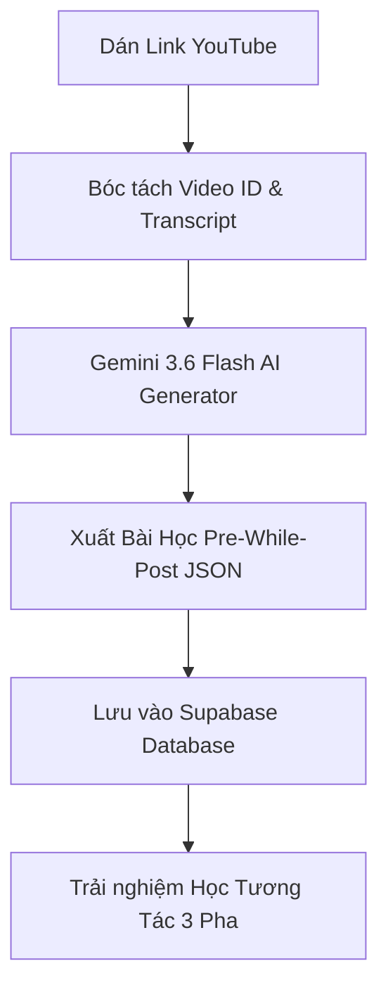

# 🏛️ AtoEnglish — Complete Product & Technical Blueprint (Tài liệu Tổng thể Dự án)

> **Tầm nhìn:** AtoEnglish là nền tảng web học tiếng Anh giao tiếp hàng đầu dành riêng cho người Việt trưởng thành mất gốc hoặc e ngại nói tiếng Anh, giúp chuyển hóa từ "biết từ vựng" sang "tự tin phản xạ tự nhiên trong đời sống và công việc".

---

## 1. Tầm Nhìn & Định Vị Sản Phẩm (Product Positioning)

### 1.1 Khách Hàng Mục Tiêu (Target Learner Persona)

- **Đối tượng:** Người Việt trưởng thành (20-40 tuổi), người đi làm hoặc sinh viên sắp tốt nghiệp.
- **Vấn đề cốt lõi:**
  - Học nhiều năm nhưng "đóng băng" (freeze) khi cần nói thực tế.
  - Nghe người bản xứ không hiểu do connected speech, tốc độ nói và ngữ điệu.
  - Sợ sai, ngại nói vì thiếu môi trường thực hành an toàn.
- **Lời hứa sản phẩm:** _Mỗi ngày 10-15 phút, sau 28 ngày tự tin giới thiệu bản thân, xử lý 5 tình huống công sở/đời sống phổ biến và phản xạ tự nhiên không cần dịch thầm trong đầu._

---

## 2. Kiến Trúc Tổng Thể Nền Tảng (System Architecture)

```text
┌─────────────────────────────────────────────────────────────────────────────┐
│                          AtoEnglish Web App Client                          │
│          (Next.js 16 App Router · Tailwind CSS v4 · Mobile-First)           │
└──────────────────────┬──────────────────────────────┬───────────────────────┘
                       │                              │
                       ▼                              ▼
┌──────────────────────────────────────┐    ┌──────────────────────────────────┐
│        Core Learning Engine          │    │       Real Talk Immersion        │
│ 50 IPOR Units · 28-Day Journey Flow  │    │ YouTube IFrame · Dual Subtitles  │
└──────────────────┬───────────────────┘    └────────────────┬─────────────────┘
                   │                                         │
                   ▼                                         ▼
┌─────────────────────────────────────────────────────────────────────────────┐
│                       AI & Speech Processing Layer                          │
│   Gemini 3.6 Flash (Lesson Gen) · Azure Pronunciation (Speaking Scoring)    │
└──────────────────────────────────────┬──────────────────────────────────────┘
                                       │
                                       ▼
┌─────────────────────────────────────────────────────────────────────────────┐
│                          Persistence & Memory Layer                         │
│     Supabase PostgreSQL (RLS) · FSRS-4.5 Memory Engine · Auth & Stats       │
└─────────────────────────────────────────────────────────────────────────────┘
```

---

## 3. Quy Trình 5 Phân Hệ Cốt Lõi (Core Product Modules)

### 🧩 Phân hệ 1: Lộ Trình Học Cấu Trúc (28-Day Speaking Journey & IPOR)

Khung bài học 11 bước theo tiêu chuẩn sư phạm IPOR (Input → Pattern → Output → Review):

1. **Can-Do Goal**: Xác định mục tiêu đầu ra cụ thể bằng tiếng Việt.
2. **Context Model**: Nghe/xem hội thoại mẫu thực tế.
3. **Meaning Input**: Nạp từ vựng & cấu trúc cốt lõi với hình ảnh + phát âm.
4. **Pattern Practice**: Luyện tập nhận diện cấu trúc ngữ pháp giao tiếp.
5. **Sound Focus**: Luyện các âm khó thường sai đối với người Việt.
6. **Controlled Retrieval**: Phản xạ từ vựng qua bài tập nhanh.
7. **Guided Translation**: Dịch câu Việt → Anh có gợi ý dàn trang.
8. **Scripted Speaking**: Luyện nói có kịch bản mẫu.
9. **Roleplay / Unscripted Output**: Nói tự do ứng biến tình huống.
10. **Immediate Feedback**: AI nhận xét phát âm & gợi ý câu tự nhiên hơn.
11. **Checkoff & SRS Seed**: Tự động lưu toàn bộ từ mới vào hàng đợi FSRS.

---

### 🎬 Phân hệ 2: Real Talk Immersion (Học Từ Video Trò Chuyện Thực Tế)

Quy trình biến video YouTube thực tế thành bài học tương tác:



- **Pha 1: Pre-Watch (3-5 phút)**: Xem ngữ cảnh, lật thẻ từ vựng + bấm 🔖 lưu vào SRS, dự đoán nội dung, lưu ý âm khó.
- **Pha 2: While-Watch (5-8 phút)**: Xem video 3 chế độ (Không sub → Dual sub EN/VN → Focus ngữ pháp/discourse markers). Sync mốc thời gian 250ms.
- **Pha 3: Post-Watch (5-7 phút)**: Trắc nghiệm đọc hiểu, điền từ vào khoảng trống, luyện nói 3 câu hay nhất, ghi chú văn hóa.

---

### 🧠 Phân hệ 3: Động Cơ Trí Nhớ FSRS-4.5 (Spaced Repetition)

Hệ thống giãn cách thời gian giúp ghi nhớ từ vựng vĩnh viễn:

- **Thuật toán FSRS-4.5**: Tối ưu lịch ôn dựa trên 4 trạng thái: _New (0), Learning (1), Review (2), Relearning (3)_ và độ ổn định (_Stability_), độ khó (_Difficulty_).
- **Thu từ vựng đa nguồn**: Tự động thu từ bài học IPOR + Nút bấm 🔖 lưu từ Real Talk + Từ trả lời sai trong bài test.
- **Cram Mode (Ôn cấp tốc)**: Ôn tập lại toàn bộ thẻ theo chủ đề bất kỳ lúc nào.

---

### 🗣️ Phân hệ 4: AI Pronunciation Coach (Chấm Phát Âm & Phản Hồi Tiếng Việt)

- **Công nghệ**: Azure Speech Assessment API (Accurate / Fluency / Completeness / Prosody).
- **L1 Vietnamese Diagnostic**: Tự động bắt lỗi nuốt âm cuối (`/s/`, `/z/`, `/t/`, `/d/`), nhầm lẫn âm `/θ/` thành `/t/`, thiếu trọng âm từ.
- **Feedback bằng Tiếng Việt**: Giải thích khẩu hình đơn giản, kèm lời khuyên chân thành và mẫu âm chuẩn để nhại lại (Shadowing).

---

### 🏆 Phân hệ 5: Gamification & Retention (Giữ Chân Người Học)

- **Daily Streak**: Đếm số ngày học liên tục, kèm khiên bảo vệ Streak (Streak Shield).
- **XP & League System**: Tích lũy XP khi hoàn thành bài học, xếp hạng tuần (Đồng → Bạc → Vàng → Kim Cương).
- **Daily XP Goal**: Đặt mục tiêu 10/20/30 phút mỗi ngày.
- **Huy hiệu thành tích (Badges)**: Mở khóa danh hiệu khi học xong 7 ngày, 28 ngày, lưu 100 từ vựng.

---

## 4. Kiến Trúc Dữ Liệu Supabase (Database Schema)

```sql
-- 1. Profiles & Gamification
CREATE TABLE public.profiles (
  id UUID PRIMARY KEY REFERENCES auth.users(id) ON DELETE CASCADE,
  display_name TEXT,
  avatar_url TEXT,
  xp INT DEFAULT 0,
  streak_count INT DEFAULT 0,
  last_active_date DATE,
  daily_goal_minutes INT DEFAULT 15,
  created_at TIMESTAMPTZ DEFAULT now()
);

-- 2. Cards (FSRS SRS Flashcards)
CREATE TABLE public.cards (
  id UUID PRIMARY KEY DEFAULT gen_random_uuid(),
  user_id UUID NOT NULL REFERENCES auth.users(id) ON DELETE CASCADE,
  word TEXT NOT NULL,
  phonetic TEXT,
  meaning_vn TEXT NOT NULL,
  example_en TEXT,
  topic TEXT DEFAULT 'General',
  level VARCHAR(5) DEFAULT 'A1',
  state INT DEFAULT 0, -- 0: New, 1: Learning, 2: Review, 3: Relearning
  difficulty FLOAT DEFAULT 0.0,
  stability FLOAT DEFAULT 0.0,
  interval INT DEFAULT 0,
  repetitions INT DEFAULT 0,
  due_date TIMESTAMPTZ DEFAULT now(),
  last_review TIMESTAMPTZ,
  next_review TIMESTAMPTZ DEFAULT now(),
  created_at TIMESTAMPTZ DEFAULT now(),
  UNIQUE(user_id, word)
);

-- 3. Real Talk Videos & Lessons
CREATE TABLE public.real_talk_videos (
  id UUID PRIMARY KEY DEFAULT gen_random_uuid(),
  slug TEXT UNIQUE NOT NULL,
  youtube_id VARCHAR(20) NOT NULL,
  title TEXT NOT NULL,
  title_vi TEXT NOT NULL,
  channel_name TEXT,
  thumbnail_url TEXT,
  duration_seconds INT NOT NULL,
  segment_start DECIMAL DEFAULT 0,
  segment_end DECIMAL NOT NULL,
  level VARCHAR(5) DEFAULT 'A1',
  topics TEXT[],
  speakers JSONB NOT NULL DEFAULT '[]'::jsonb,
  created_by UUID REFERENCES auth.users(id),
  is_public BOOLEAN DEFAULT true,
  created_at TIMESTAMPTZ DEFAULT now()
);

CREATE TABLE public.real_talk_lessons (
  id UUID PRIMARY KEY DEFAULT gen_random_uuid(),
  video_id UUID UNIQUE REFERENCES public.real_talk_videos(id) ON DELETE CASCADE,
  title TEXT NOT NULL,
  title_vi TEXT NOT NULL,
  level VARCHAR(5) DEFAULT 'A1',
  estimated_minutes INT DEFAULT 15,
  can_do_statement_vi TEXT,
  transcript JSONB NOT NULL,
  pre_watch JSONB NOT NULL,
  while_watch JSONB NOT NULL,
  post_watch JSONB NOT NULL,
  created_at TIMESTAMPTZ DEFAULT now()
);
```

---

## 5. Quy Trình Phát Triển & Triển Khai (Deployment & Execution Roadmap)

### Giai Đoạn 1: Hoàn Thiện MVP Core (Đã hoàn thành)

- [x] Khung UI Next.js 16 + Tailwind v4 + Mobile-first Bottom Navigation.
- [x] Động cơ FSRS Flashcard SRS & Server Actions.
- [x] Module Real Talk (Player, Transcript, Pre-While-Post Phases).
- [x] AI Lesson Generator tích hợp Gemini 3.6 Flash.
- [x] Migration SQL & RLS Policies.

### Giai Đoạn 2: Tối Ưu Hóa & Trải Nghiệm Người Dùng (Hiện tại)

- [ ] Tích hợp Supabase Live Database connection hoàn chỉnh cho Real Talk.
- [ ] Thử nghiệm người dùng thật (Usability Testing) trên 10 bài Real Talk.
- [ ] Tối ưu hóa điểm Web Vitals (LCP < 1.2s, INP < 100ms trên di động).

### Giai Đoạn 3: Production Scaling & Analytics

- [ ] Triển khai Vercel Production Deployment + Domain chính thức.
- [ ] Tích hợp Sentry cho Error Monitoring & Telemetry.
- [ ] Thêm chế độ học Offline/PWA cho thiết bị di động.

---

> **Kết luận:** AtoEnglish đã có nền tảng kỹ thuật và kiến trúc sản phẩm cực kỳ vững chắc, đáp ứng đầy đủ tiêu chí sư phạm SLA và trải nghiệm người dùng hiện đại.
