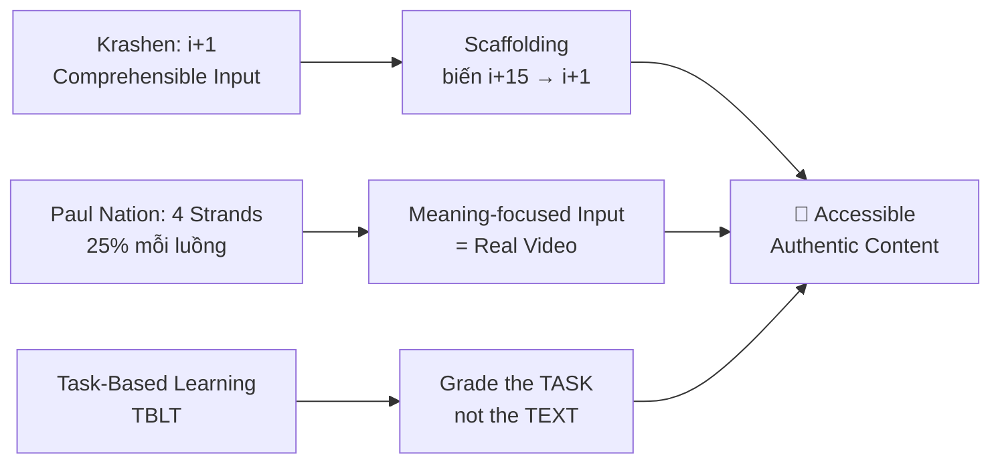
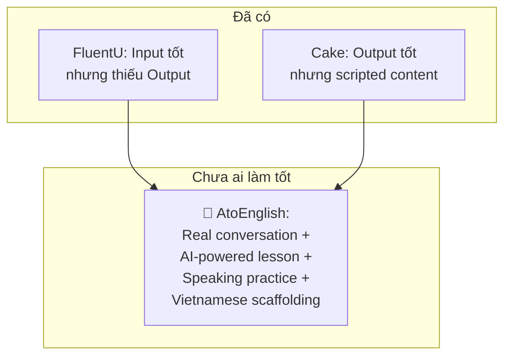
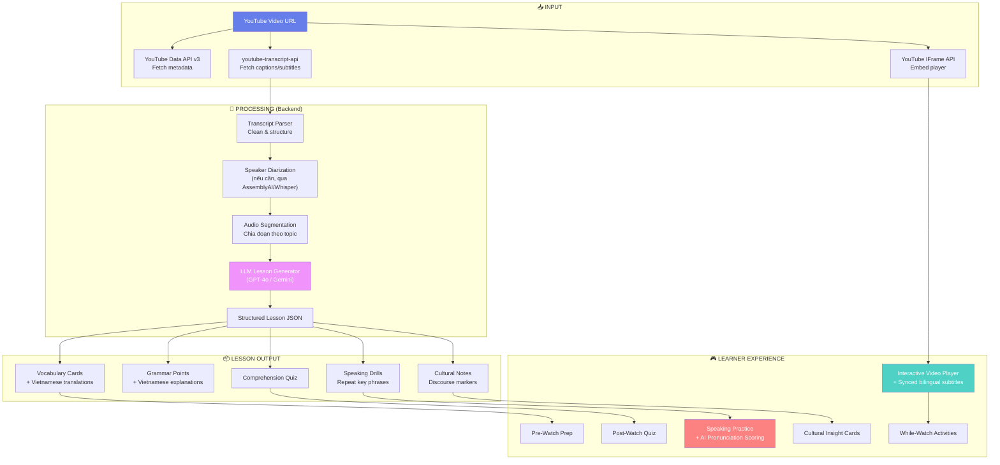
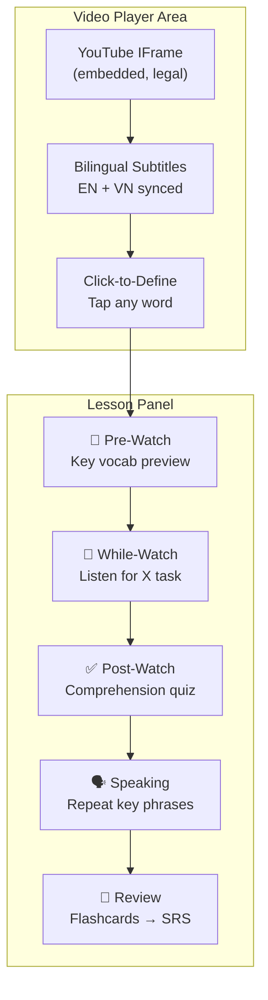

# 🎬 YouTube Real Conversations → English Lessons (Real Talk Spec)

> **Idea:** Lấy video trò chuyện thực tế từ YouTube, xử lý bằng AI, và biến thành bài học tiếng Anh có cấu trúc cho người Việt mất gốc.

> [!IMPORTANT]
> Đây là tính năng **mở rộng sau MVP** — MVP hiện tại tập trung scripted speaking cho Pre-A1/A0. Feature này phù hợp cho giai đoạn **A1 → A2+** hoặc như một module bổ sung "Real Talk / Immersion Lab".

---

## 1. Tại Sao Idea Này Mạnh?

### 1.1 Vấn Đề Hiện Tại Của Người Việt Học Tiếng Anh

| Vấn đề                              | Mô tả                                                                        |
| ----------------------------------- | ---------------------------------------------------------------------------- |
| **Khoảng cách classroom ↔ thực tế** | Học xong giáo trình vẫn không hiểu người bản xứ nói gì                       |
| **Connected speech**                | Người Việt quen nghe từng từ rõ ràng, không quen linking/reduction           |
| **Discourse markers**               | Không biết "you know", "I mean", "like", "actually" nghĩa gì trong hội thoại |
| **Tốc độ nói thực**                 | Giáo trình nói chậm ~120 WPM, người bản xứ nói ~160-200 WPM                  |
| **Ngữ cảnh văn hóa**                | Thiếu exposure vào cách giao tiếp thực tế phương Tây                         |

### 1.2 Tại Sao Video Trò Chuyện Thực Tế Là Giải Pháp

- **Authentic input** cung cấp ngôn ngữ thật, không bị lọc qua lăng kính giáo trình
- **Visual context** (cử chỉ, biểu cảm, môi trường) giúp hiểu nghĩa mà không cần dịch từng từ
- **Motivation cao** — xem video thực tế thú vị hơn nhiều so với dialogue giáo trình
- **Cầu nối từ "học" sang "dùng"** — chuẩn bị learner cho giao tiếp thực tế

### 1.3 Nền Tảng Sư Phạm (SLA Research)



> [!NOTE]
> **Nguyên tắc vàng từ SLA research:** _"Grade the task, not the text."_
> Không cần tránh authentic materials cho beginner — chỉ cần thiết kế task phù hợp level.
> Ví dụ: Cùng 1 video, task Pre-A1 = "Đếm số lần nghe từ 'coffee'", task A2 = "Tóm tắt cuộc trò chuyện".

---

## 2. Phân Tích Đối Thủ

### 2.1 Các Sản Phẩm Hiện Có

| Sản phẩm     | Cách tiếp cận                                     | Điểm mạnh                              | Điểm yếu                                                       |
| ------------ | ------------------------------------------------- | -------------------------------------- | -------------------------------------------------------------- |
| **FluentU**  | Embed YouTube IFrame + interactive dual-subtitles | Click-to-define, video flashcards, SRS | Thiếu output (speaking), không có AI feedback, đắt ($30/tháng) |
| **YouGlish** | Tìm phát âm từ vựng qua YouTube transcripts       | Nghe 1 từ trong hàng ngàn context      | Không phải hệ thống học, chỉ là công cụ tra cứu                |
| **LingQ**    | Import YouTube transcript → reading tool          | Massive input, stats chi tiết          | UX phức tạp, thiếu speaking practice                           |
| **Cake**     | Short clips + AI pronunciation grading            | Engaging, quizzes hay                  | Licensed content, không dùng real unscripted convos            |
| **EWA**      | Movie clips + interactive games                   | Gamification tốt                       | Tập trung entertainment hơn learning                           |

### 2.2 Khoảng Trống Thị Trường (Gap)



**Điểm khác biệt cốt lõi của AtoEnglish:**

1. **Full pipeline**: Input (xem) → Comprehension (hiểu) → Practice (luyện) → Output (nói)
2. **Vietnamese-first scaffolding**: Giải thích bằng tiếng Việt, highlight lỗi đặc thù người Việt
3. **AI-generated lessons**: Tự động tạo bài học có cấu trúc từ bất kỳ video nào
4. **Pronunciation coaching**: Chấm phát âm + feedback cụ thể cho người Việt
5. **SRS integration**: Từ vựng/cụm từ từ video đi vào hệ thống ôn tập

---

## 3. Kiến Trúc Kỹ Thuật

### 3.1 Pipeline Tổng Quan



### 3.2 Chi Tiết Từng Component

#### A. Video Ingestion (Lấy Video)

| Component          | Tool/API                          | Chi tiết                                                                                              |
| ------------------ | --------------------------------- | ----------------------------------------------------------------------------------------------------- |
| **Video metadata** | YouTube Data API v3               | Title, duration, channel, thumbnail. API key đơn giản. Chi phí: 1 unit/call (quota 10,000 units/ngày) |
| **Transcript**     | `youtube-transcript-api` (Python) | Lấy manual + auto-generated captions. Không cần API key. ⚠️ Unofficial — có thể break                 |
| **Video playback** | YouTube IFrame API                | Embed player chính thức. ✅ **Legal & compliant** — views tính cho creator, ads vẫn chạy              |

> [!WARNING]
> **KHÔNG download video/audio** — vi phạm YouTube ToS. Luôn dùng IFrame embed.
> Chiến lược FluentU: Overlay UI riêng lên IFrame player, sync subtitles với player timestamp.

#### B. Transcript Processing

```
Raw transcript (từ YouTube)
    │
    ▼
┌─────────────────────────────┐
│  Clean & Normalize          │
│  - Loại bỏ [Music], [Applause]  │
│  - Fix punctuation          │
│  - Merge short fragments    │
│  - Preserve timestamps      │
└─────────────────────────────┘
    │
    ▼
┌─────────────────────────────┐
│  Speaker Identification     │
│  Option A: Manual tag       │
│  Option B: AssemblyAI API   │
│  Option C: WhisperX + pyannote │
└─────────────────────────────┘
    │
    ▼
┌─────────────────────────────┐
│  Semantic Segmentation      │
│  - LLM finds topic shifts   │
│  - Align with silence/VAD   │
│  - Output: 1-3 min segments │
└─────────────────────────────┘
```

**Speaker Diarization — So Sánh:**

| Provider                   | Accuracy                             | Diarization             | Word Timestamps  | Giá             |
| -------------------------- | ------------------------------------ | ----------------------- | ---------------- | --------------- |
| **AssemblyAI**             | ⭐⭐⭐⭐⭐ Tốt nhất cho conversation | ✅ Native, ≤30 speakers | ✅ Chính xác     | ~$0.15-0.21/giờ |
| **Deepgram**               | ⭐⭐⭐⭐ Nhanh nhất                  | ✅ Native               | ✅               | ~$0.26/giờ      |
| **OpenAI Whisper**         | ⭐⭐⭐⭐ Đa ngôn ngữ                 | ❌ Không native         | ✅ (legacy)      | ~$0.36/giờ      |
| **WhisperX** (self-hosted) | ⭐⭐⭐⭐                             | ✅ Via pyannote         | ✅ Rất chính xác | Free (GPU cost) |
| **Google STT**             | ⭐⭐⭐⭐ Enterprise                  | ✅ Built-in             | ✅               | ~$1.44/giờ      |

> [!TIP]
> **Đề xuất cho MVP:** Dùng `youtube-transcript-api` lấy captions có sẵn (miễn phí, không cần STT).
> Chỉ dùng AssemblyAI/Whisper khi video không có captions hoặc captions chất lượng kém.

#### C. AI Lesson Generation

**Prompt Template cho LLM:**

```json
{
  "role": "system",
  "content": "Bạn là giáo viên tiếng Anh chuyên gia cho người Việt mất gốc (Pre-A1/A0 → A2)."
}
```

**Input → Output:**

```
INPUT:
  - Diarized transcript với timestamps
  - Video metadata (topic, duration)
  - Target learner level (A0/A1/A2)

OUTPUT (Structured JSON):
  {
    "lesson_title": "Ordering Coffee at a Café",
    "level": "A1",
    "duration_minutes": 15,
    "video_segment": { "start": 45, "end": 180 },

    "vocabulary": [
      {
        "word": "grab a coffee",
        "definition": "to get a coffee (informal)",
        "vietnamese": "lấy/mua một ly cà phê",
        "context_sentence": "Hey, wanna grab a coffee?",
        "timestamp": 52,
        "pronunciation_note": "Chú ý: 'grab a' phát âm liền = /ɡræbə/"
      }
    ],

    "grammar_points": [
      {
        "pattern": "Wanna + verb = Want to + verb",
        "explanation_vi": "'Wanna' là cách nói tắt của 'want to' trong giao tiếp hàng ngày",
        "examples_from_video": ["Wanna grab a coffee?", "I wanna try that"]
      }
    ],

    "discourse_markers": [
      {
        "marker": "you know",
        "function": "Kiểm tra người nghe có hiểu/đồng ý không",
        "vietnamese_equivalent": "bạn biết đấy / ý là",
        "timestamp": 67
      }
    ],

    "comprehension_quiz": [...],
    "fill_in_the_blank": [...],
    "speaking_drills": [...],
    "cultural_notes": [...]
  }
```

#### D. Interactive Player & Learning UI



---

## 4. Khung Bài Học: Pre-While-Post

### 4.1 Cấu Trúc Bài Học Chi Tiết

Mỗi video conversation được biến thành bài học theo khung **Pre-While-Post** (PWP), tích hợp với flow 11 bước hiện có của AtoEnglish:

#### Phase 1: PRE-WATCH (3-5 phút)

**Mục tiêu:** Giảm anxiety, activate prior knowledge, front-load vocabulary

- **1.1 Context Setup:** Hiển thị thumbnail + tiêu đề + 1 câu mô tả bằng VN
- **1.2 Vocab Preview:** 5-8 từ/cụm quan trọng nhất với hình ảnh + audio + VN
- **1.3 Prediction:** "Bạn nghĩ họ sẽ nói gì?" — multiple choice
- **1.4 Sound Alert:** Highlight 1-2 âm khó cho người Việt sẽ xuất hiện trong video

#### Phase 2: WHILE-WATCH (5-8 phút)

**Mục tiêu:** Active listening, comprehension, pattern recognition

- **2.1 Gist Watch:** Xem lần 1 KHÔNG subtitle — chỉ trả lời "Video nói về gì?"
- **2.2 Detail Watch:** Xem lần 2 VỚI bilingual subtitles — tap từ để xem nghĩa
- **2.3 Focus Watch:** Xem lần 3 đoạn ngắn — highlight grammar pattern hoặc discourse marker
- **2.4 Speed Control:** Nút slow (0.75x) cho đoạn khó

#### Phase 3: POST-WATCH (5-7 phút)

**Mục tiêu:** Comprehension check, practice, output

- **3.1 Comprehension Quiz:** 3-5 câu hỏi về nội dung video
- **3.2 Vocab Exercise:** Fill-in-the-blank dùng từ trong video
- **3.3 Listen & Repeat:** Nghe và lặp lại 3-5 câu hay nhất từ video
- **3.4 Shadowing:** Nghe audio gốc + nói theo cùng lúc (advanced)
- **3.5 SRS Queue:** Vocab + phrases mới đưa vào hàng đợi ôn tập

---

## 5. Implementation Stack & Status

### Core Components Implemented in Repo:

- **Types:** `src/types/real-talk.ts`
- **Sample Data:** `src/lib/data/real-talk/videos.ts`
- **Interactive Player:** `src/components/real-talk/YouTubePlayer.tsx`
- **Transcript Panel:** `src/components/real-talk/TranscriptPanel.tsx`
- **Pre-Watch Phase:** `src/components/real-talk/PreWatchPhase.tsx`
- **While-Watch Phase:** `src/components/real-talk/WhileWatchPhase.tsx`
- **Post-Watch Phase:** `src/components/real-talk/PostWatchPhase.tsx`
- **Lesson Orchestrator:** `src/components/real-talk/RealTalkLesson.tsx`
- **Catalog Page:** `src/app/(main)/real-talk/page.tsx`
- **Lesson Page:** `src/app/(main)/real-talk/[videoId]/page.tsx`
